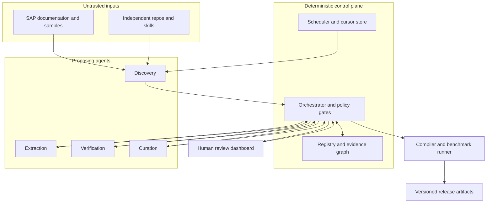
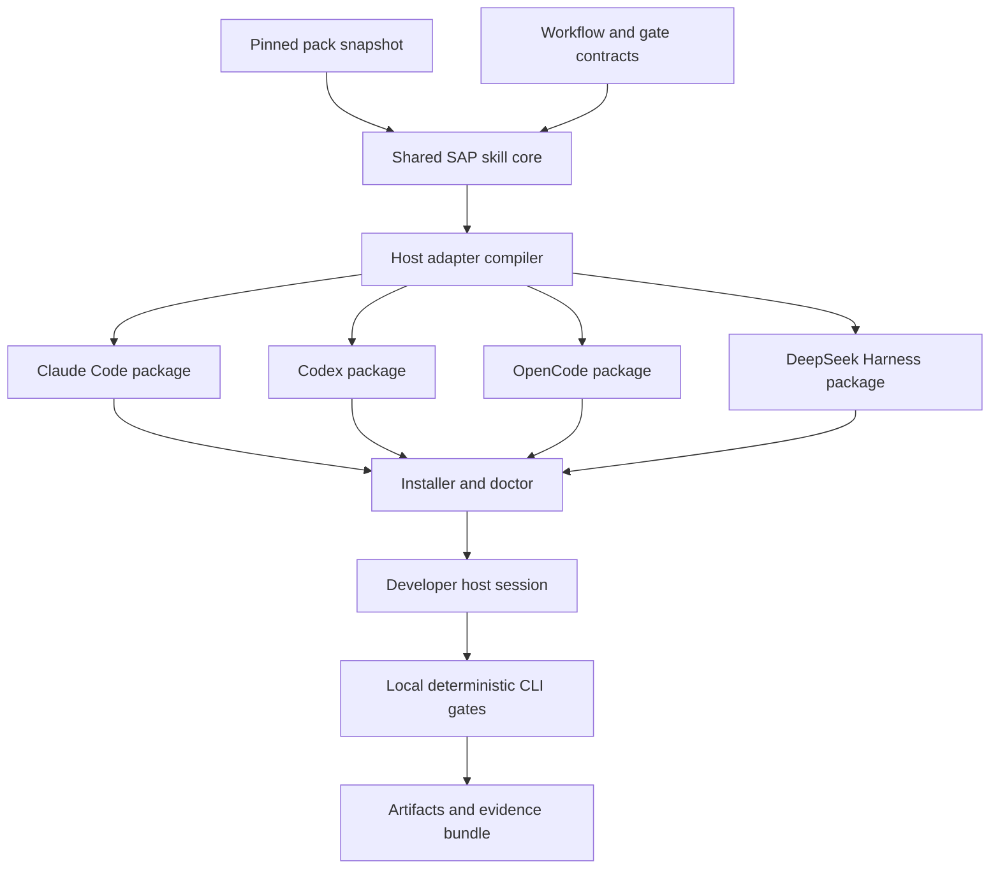

# System architecture

## Harvest and publication topology

No agent directly writes an approved item or release. The orchestrator admits only typed proposals and performs source, schema, license, confidence, consistency, benchmark, and reviewer gates. Store raw fetches in a quarantine cache separately from normalized evidence and published content.

## Skill distribution and runtime

The host's assistant executes workflow instructions; the local CLI checks manifests, evidence, and stage transitions. An optional future SAP tool broker would be a separate permissioned boundary. Local repository work and generated artifacts stay with the developer, and feedback enters harvesting only through explicit submission and screening.

## Component ownership

| Component | Inputs | Outputs | Invariant |
|---|---|---|---|
| Source connectors | allowlisted URI, credentials, cursor | content/revision/license metadata | Read-only, terms-aware, rate-limited. |
| Discovery | connector metadata, coverage gaps, delta job | ranked source/skill candidates | Candidate state only; no instruction execution. |
| Extraction | quarantined source, versioned schema/prompt | atomic item proposals and citations | Every proposal points to a retrievable span/revision. |
| Verification | proposals, official sources, conflicts | evidence scores, contradiction flags | No self-approval; unverified claims quarantined. |
| Curation | verified items, taxonomy, pack rules | proposed pack diffs | No mutation of published snapshots. |
| Orchestrator | typed events, policy, reviewer actions | durable transitions, audit | Idempotency keys and transactional checkpoints. |
| Compiler | approved snapshot/core/adapters | host bundles and manifest | Deterministic build with hashes and version pins. |
| Dashboard | registry views, authenticated reviewer actions | decisions, audit | Loopback by default; role checks server-side. |

## Data flow and failure behavior

Fetch → quarantine → parse → propose → verify → curate → human review → benchmark → release. Fetch and model failures retry with capped exponential backoff; permanent schema/license failures go to a dead-letter queue. A failed page never advances the cursor. A source retraction or license change marks dependent items and snapshots for recheck; published releases remain immutable but can be revoked with notice and a safe rollback pointer. See `DATA_MODEL.md` and `SOURCE_POLICY.md`.

## Deployment and trust boundaries

Single-user operation uses local scheduler, SQLite, CLI and loopback dashboard; team deployment uses a transactional DB, job workers, authenticated reviewer UI, and CI release pipeline. Both use the same state contracts. External content, model responses, local customer repositories, and host tools are separate trust zones. Only explicitly authorized metadata exits the local environment. See `SECURITY.md`.
