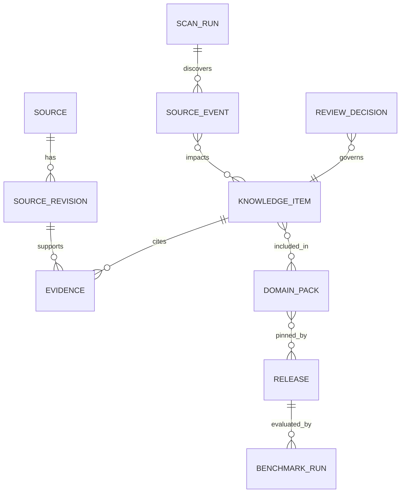

# Data model and lifecycle

## Core entities

| Entity | Key fields and constraints |
|---|---|
| `Source` | ID, canonical URI, source kind, owner, authority tier, domain tags, terms/license status, allowlist status; unique canonical URI. |
| `SourceRevision` | source ID, commit SHA or doc version, fetched UTC, content hash, ETag, last-modified, license evidence, cache pointer; immutable and unique revision/hash. |
| `ScanRun` | kind, window bounds, cursor before/after, status, page checkpoint, counts, errors, started/finished; advance cursor only on success. |
| `SourceEvent` | source, revision, changed/deleted/renamed/license-changed/retracted type, observed time, upstream time, dedup key, impacted item IDs. |
| `SkillCandidate` | repo/revision, manifest locations, host compatibility, license, maintenance signals, prompt-injection findings, overlap, review status; never executable. |
| `KnowledgeItem` | stable ID, semantic type, claim/pattern, normalized code excerpt or pointer, edition, release min/max, confidence tuple, status, created/superseded UTC. |
| `Evidence` | item ID, source revision ID, span/locator, evidence role, verification method, verifier version, confidence; immutable edge. |
| `Conflict` | item IDs, scope, conflicting claims, severity, disposition and rationale; unresolved blocking conflicts prevent release. |
| `DomainPack` | one of 15 IDs, taxonomy version, approved item refs, prerequisite pack refs, coverage matrix, pack version. |
| `ReviewDecision` | object ID/version, reviewer, decision, rationale, timestamp, policy version, signature/audit chain; no silent overwrite. |
| `BenchmarkRun` | corpus version, release candidate hash, host version, metrics, failures, runner version and evidence location. |
| `Release` | immutable versioned manifest, component pins, hashes, approval, status, changelog, revocation/supersession link. |
| `WorkflowArtifact` | local project/flow ID, stage, artifact schema/version, input hash, evidence class, approver, transition; local only by default. |

## Knowledge state machine

`DISCOVERED → EXTRACTED → VERIFIED → CURATED → REVIEW_PENDING → APPROVED → PUBLISHED`. Alternative transitions: any proposal → `REJECTED` with rationale; verified/approved/published item → `RECHECK_REQUIRED` after relevant source change, release applicability conflict, license change, or benchmark regression; recheck resolves via new revision/approval or `RETRACTED`. Published snapshots are immutable; a corrective release replaces them. Human approval is a distinct transaction with reviewer identity and object version.

## Confidence and applicability

Keep a tuple rather than a magic score: source authority, revision fidelity, claim support, corroboration, applicability specificity, recency, and conflict state. A high confidence example does not become a normative API rule. `edition` is an explicit set (for example ABAP Cloud vs on-premise S/4HANA); `release` is a declared interval or unknown. Unknown applicability blocks normative publication until reviewed. Preserve alternatives and exceptions.

## Integrity, migration, and retention

Foreign keys on, immutable source revisions/evidence/release manifests, uniqueness on event dedup keys, optimistic version for review, append-only audit. Migrations have forward/backward rehearsal and backup. Raw untrusted source cache is time-bounded and quarantined; metadata and provenance retention follows terms and review policy. Customer project artifacts never enter the shared registry without explicit, sanitized submission. Index source revision, item status/domain/applicability, scan checkpoint, and evidence edges.
