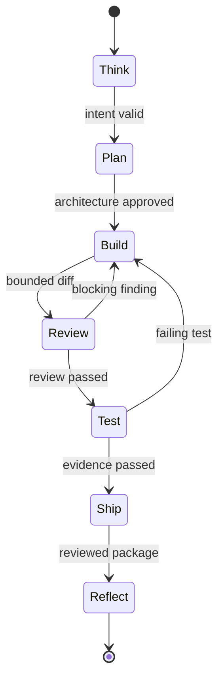

# Portable SAP development workflow

The seven-stage skill is an original SAP-specific implementation of an architecture-first workflow inspired by gstack. It uses host-native invocation and a shared stage contract. The model guides work; `supersap workflow check` validates required artifacts and evidence. A human decides architecture and release actions. Stage schemas include project ID, edition/release, inputs, cited knowledge snapshot, decisions, status and provenance.

| Stage | Required input and artifact | Deterministic exit gate |
|---|---|---|
| Think | User goal, SAP landscape/edition/release or explicit unknown, business process, existing standard capabilities, constraints, questions → `intent.md` | Scope, assumptions, acceptance and unsupported unknowns recorded; request missing release where advice depends on it. |
| Plan | `intent.md`, relevant packs → `solution-design.md`, `adr.md`, `object-map.json` | Compare standard vs custom, at least one feasible alternative for nontrivial work, released API/Clean Core assessment, auth/data flow, test plan, human plan approval. |
| Build | Approved plan → bounded source change and `change-manifest.json` | Changed objects trace to plan, dependencies and local checks; no unrelated changes or unauthorized live write. |
| Review | Source diff, relevant packs → `review.md` | Check correctness, release applicability, auth, performance, failure paths, clean-core, upgrade safety, provenance; resolve blocking findings. |
| Test | Test plan and implementation → `test-evidence.json` | Static tests and meaningful scenarios pass; tag each result `STATIC`, `MOCK`, or `LIVE` with tool/landscape evidence; missing live validation is explicit. |
| Ship | Reviewed changes and tests → PR description, release notes and `ship-checklist.json` | Human review, exact test evidence, reproducible diff, no secret/unsupported claim; GitHub PR/package, no autonomous SAP deployment. |
| Reflect | Review/test/usage feedback → `feedback-candidate.json` | Sanitize and require opt-in before feeding harvester; no auto-promotion. |

For a trivial correction, artifacts may be compact and stages can be performed in one session, but edition/release, review, evidence type and ship claims still need validation. Host agents may pause for user input; a missing approval cannot be synthesized. A CLI gate prevents a false status transition, but cannot sandbox arbitrary host tools. The skill should explain limitations honestly.

## SAP specific decision checks

Assess standard capability before customization; distinguish ABAP Cloud, S/4 on-premise and other editions; prefer released APIs where required; check CDS access control and RAP authorization; model integration retries/idempotency; include performance and upgrade behavior; choose appropriate ABAP Unit, ATC and UI/integration tests. Each recommendation links to knowledge item IDs and applicable release. If a rule is unknown or conflicted, label it and escalate rather than guessing.

## Output interoperability

Use stable JSON schemas for gates and concise Markdown for human review. Store workflow artifacts in a project-local `.supersap/` directory excluded from global harvesting unless explicitly exported. Host adapters may change trigger syntax and tool instructions but must produce the same artifact schema and gate outcomes.
